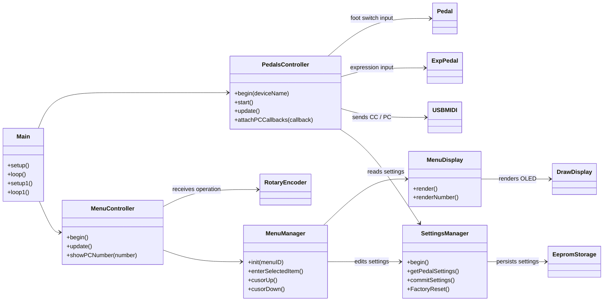
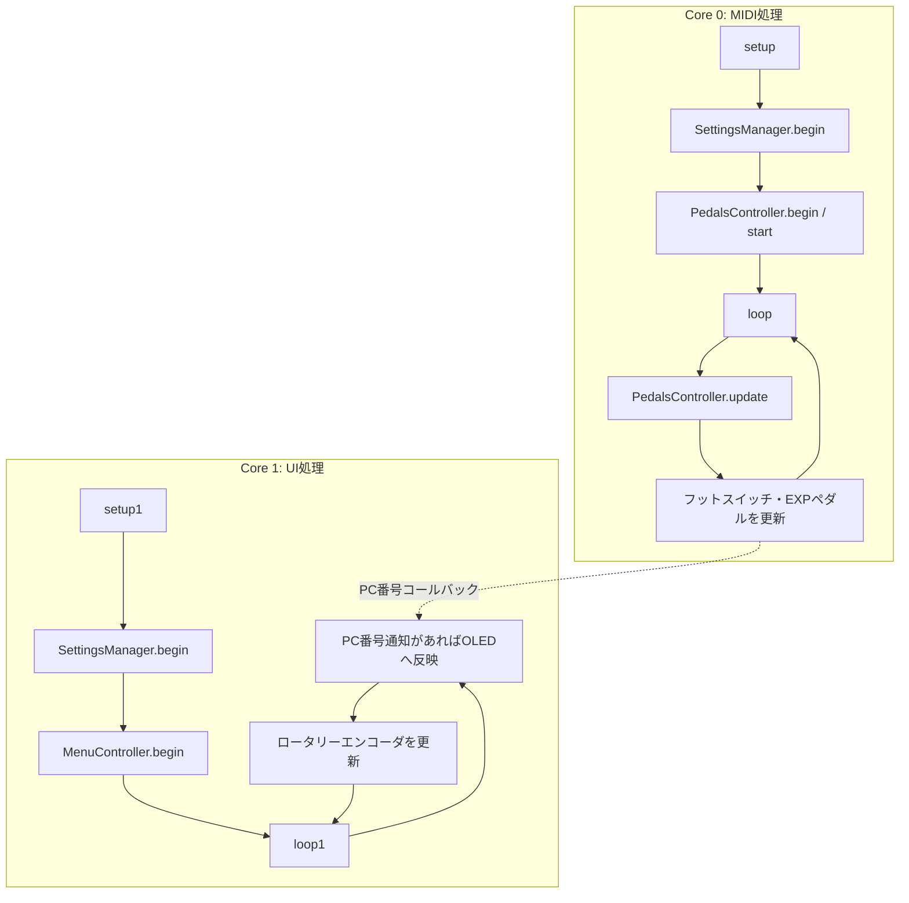
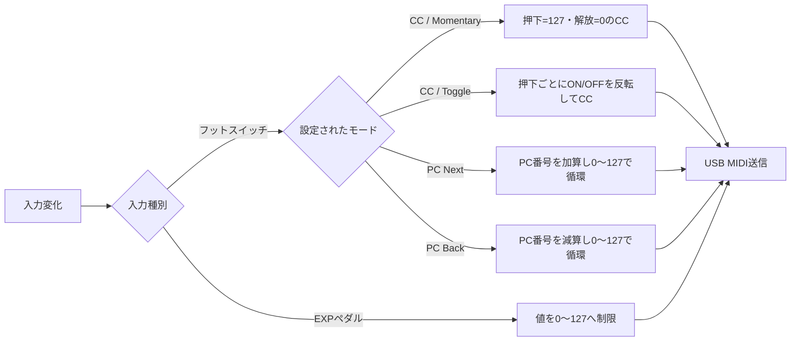
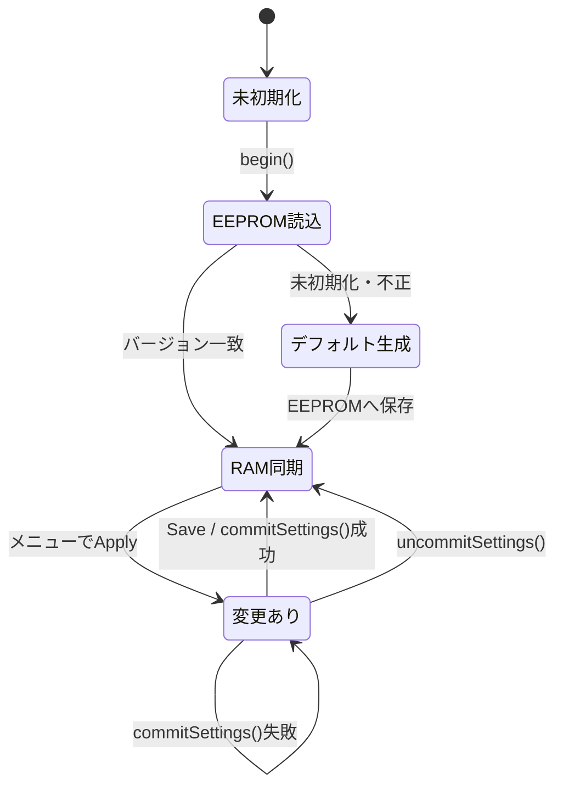
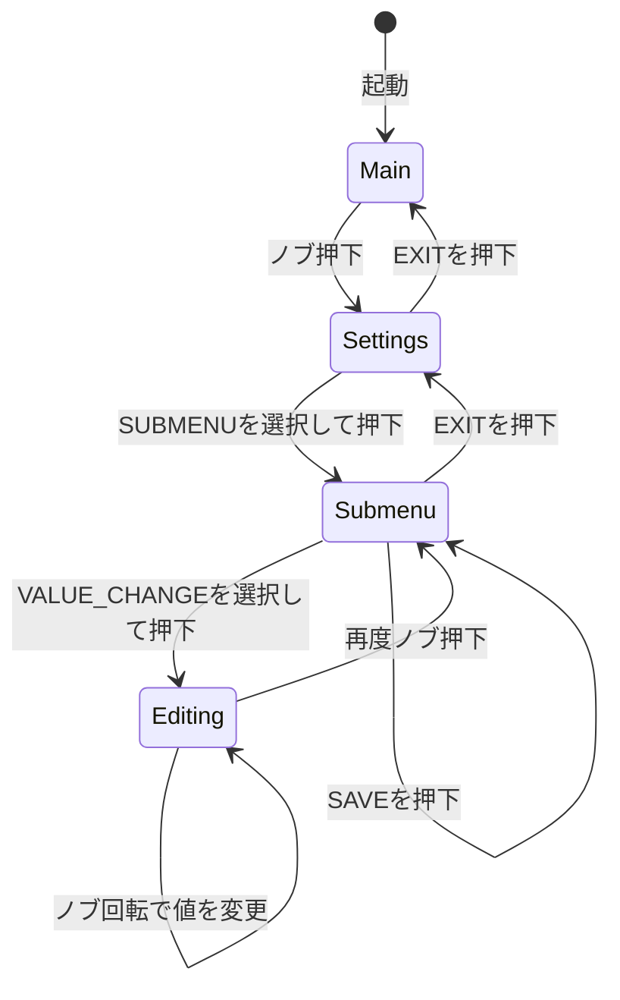

# ソフトウェアアーキテクチャ

このドキュメントは、USB-MIDI Pedal ファームウェアの主要コンポーネント、データの流れ、メニュー操作の状態遷移を説明します。

## 目的と実行環境

RP2040 Zero 上で動作し、フットスイッチとエクスプレッションペダルの入力を USB-MIDI の CC（Control Change）または PC（Program Change）メッセージに変換します。OLED とロータリーエンコーダを使い、各ペダルの設定を本体だけで変更できます。

- 言語／フレームワーク: C++、Arduino Core for RP2040、PlatformIO
- USB MIDI: TinyUSB と MIDI Library
- 設定保存先: EEPROM 互換ストレージ
- 表示: I2C 接続 OLED

## 全体構成

`Hal*` インターフェース（`HalPedal`、`HalExpPedal`、`HalUSBMIDI`、`HalDisplay`、`HalRotaryEncoder`、`HalStorage`）が、アプリケーション層と具体的なハードウェア実装の間を分離します。このため、nativeテストでは実機の代わりにモックを渡せます。

## 二つの実行ループ

RP2040 の二つのコアを使用し、演奏時のMIDI処理と画面／設定操作を分離します。

`PedalsController` が PC を送信すると、登録済みコールバックを介して `main.cpp` のPC番号を更新します。Core 1 側はその値を `MenuController` に渡し、メイン画面へ表示します。

## 演奏時の処理

- フットスイッチのデバウンスは `Pedal` が担当します。
- `PedalsController` は `SettingsManager` から各ペダルのモード、MIDIチャンネル、CC番号、スイッチ方式を読み取ります。
- EXPペダルは MCP3421 で読み取り、変化量がしきい値を超えた場合だけ CC を送信します。

## 設定のライフサイクル

設定はまず `SettingsManager` 内のRAMに保存されます。メニューの **Apply** はRAMの設定を更新し、**Save** が `commitSettings()` を呼び出してEEPROMへ永続化します。保存前の変更があるかは `dirty_` フラグで管理されます。

## メニュー操作の状態遷移

メニューの実体は `MenuState` に定義された `MenuConfig` と `MenuItem` です。`MenuManager` は「閲覧」と「値変更」の二つの操作モードを管理します。

| 操作 | 閲覧モード | 値変更モード |
| --- | --- | --- |
| ノブ回転 | カーソルを上下に移動 | 選択中パラメータを最小値〜最大値の範囲で変更 |
| ノブ押下 | 項目の種類に応じて遷移・実行 | 値変更モードを終了 |

項目種別は以下です。

| 種別 | 動作 |
| --- | --- |
| `SUBMENU` | 子メニューへ移動 |
| `VALUE_CHANGE` | パラメータ編集モードの開始／終了 |
| `APPLY` | 編集中のパラメータを `SettingsManager` へ反映 |
| `SAVE` | RAM上の設定をEEPROMへ保存 |
| `FUNCTION` | 現在は設定画面からの工場出荷時リセットに使用 |
| `EXIT` | 親メニューへ戻る |

## 関連する主なソース

| 役割 | ファイル |
| --- | --- |
| 起動と2コアループ | `src/main.cpp` |
| MIDI入力の制御 | `src/app/PedalsController/` |
| メニュー入力の制御 | `src/app/MenuController/` |
| メニュー状態・設定反映 | `src/app/MenuManager/` |
| 設定のRAM管理と永続化 | `src/app/SettingsManager/` |
| ハードウェア抽象化 | `lib/Hal/` |
| 実機ドライバ実装 | `lib/Pedal/`, `lib/ExpPedal/`, `lib/USBMIDI/`, `lib/DrawDisplay/`, `lib/EepromStrage/` |
